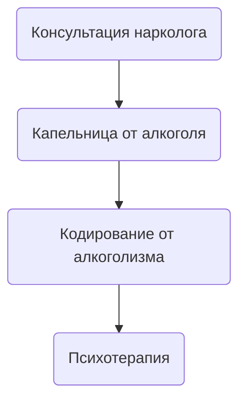

Женский алкоголизм - это тяжелое хроническое патологическое состояние которое развивается у женщины в следствии длительного и регулярного употребления алкоголя. Оно характерно бесконтрольным и регулярным приемом алкогольных напитков в больших объемах сопровождающееся обязательно такими критериями как - высокая толерантность к выпивке, утрата социального контроля , а так же патологическое желание выпить и похмелиться.

## Симптомы женского алкоголизма

Симптомы женского алкоголизма можно разделить на ранние и поздние

К ранним симптомам женского алкоголизма относятся: Нервозность и психоэмоциональная лабильность , отсутствие аппетита во время выпивки , увеличивается частота употребления, любой выходной или прогулка в город сопровождается алкогольными напитками.

К поздним симптомам женского алкоголизма относятся: Тяжелое нарушение сна - бессонница , отсутствие тошноты и рвоты вне зависимо от объема выпитого спиртного, высокая толерантность и постоянное желание выпить , наличие симптома опохмеление. К поздним симптомам женского алкоголизма так же относится патологическое вранье и "скрытность" пациента.

## Как формируется алкоголизм у женщин ?

Алкоголизм у женщин формируется под воздействием биологических, психологических и социальных факторов. Биологически женщины быстрее становятся зависимыми из-за особенностей метаболизма и гормональных изменений. Психологически алкоголь часто используется для снятия стресса, тревожности или депрессии. Социальные факторы, такие как давление общества или проблемы в отношениях, также могут способствовать злоупотреблению. Зависимость развивается через несколько этапов: от случайного употребления до хронической зависимости, сопровождающейся серьёзными последствиями для здоровья и личной жизни.

Алкоголизм у женщин развивается быстрее, чем у мужчин, и часто сопровождается более серьезными физическими и психическими последствиями. Проблема усугубляется тем, что женщины реже обращаются за помощью, что делает раннюю диагностику и лечение алкоголизма сложной задачей.

## Признаки женского алкоголизма

1. Частое и неконтролируемое употребление алкоголя.
2. Снижение социальной активности — избегание работы, семьи и друзей.
3. Изменения внешности — отёки, покраснения, сосудистые звёздочки на лице, ухудшение состояния кожи и волос.
4. Эмоциональная нестабильность — раздражительность, депрессия, агрессия.
5. Увеличение дозы алкоголя — необходимость пить больше для достижения эффекта.
6. Потеря контроля — неспособность прекратить пить, даже осознавая последствия.
7. Физическая зависимость — появление абстинентного синдрома (тремор, потливость, головные боли) при отказе от алкоголя.
8. Проблемы со здоровьем — нарушения в работе печени, сердца, желудочно-кишечного тракта.
9. Эти признаки могут проявляться как постепенно, так и резко в зависимости от стадии зависимости.

## Стадии женского алкоголизма

Принято делить женский алкоголизма на три стадии:

1.Ранняя стадия женского алкоголизма сопровождается учащенным употреблением спиртного под прикрытием тяжелого дня или стрессовой работы которая сопровождается такими симптомами как : учащенное употребление без повода , алкоголь употребляется для улучшения субъективного настроения , теряется контроль над объемом выпиваемого , нарушается сон и появляется агрессия.

2.Вторая стадия или стадия физической зависимости - на второй стадии появляется физическая зависимость от алкоголя вследствие прогрессирования женского алкоголизма из за частого употребления спиртного, сопровождается она первыми запоями , желанием опохмелиться а так же сменой планов ради выпивки с утратой социального контроля над ситуацией после приема алкоголя.

3.Третья стадия - стадия полной деградации - на третьей стадии выпивка становится на постоянной основе и занимает любое свободное время , развивается аморальное и асоциальное поведение , сильнейшая деградация пациентки , снижение интеллекта а так же утрата чувства ответственности и какого либо социального контроля, появляются суицидальные мысли а так же присоединяются хронические заболевания сердца , печени и центральной нервной системы.

## Как вылечить женский алкоголизм Одесса?

Что бы вылечить женский алкоголизм вам нужно обратиться к врачам наркологам города Одессы по номеру 050-021-69-57. Доктор оценит состояние пациентки , проведет первичную консультацию а так же определит стадию и составит индивидуальный план лечения зависимой женщины.

Что бы вылечить женский алкоголизм пациентка должна пройти три обязательных основных этапа в лечении зависимости

* 1.Детоксикационная терапия - капельница от алкоголя на дому или в стационаре
* 2.Кодирование от алкоголизма одним из трех вариантов ( кодирование уколом , кодирование подшивкой , кодирование по методу Довженко )
* 3.Психотерапевтическая помощь для формирования стойкой трезвости

## Стоимость лечения женского алкоголизма в Одессе

Стоимость лечение женского алкоголизма в Одессе начинается от 1499грн и может меняться в зависимости от тяжести и стадии зависимой.

| Услуга                                                                       | Цена         |
| ---------------------------------------------------------------------------- | ------------ |
| [Лечение алкоголизма Одесса](lechenie-alkogolizma-odessa)                    | От 1499 грн  |
| [Вывод из запоя Одесса](vivod-iz-zapoya)                                     | От 1499 грн  |
| [Вывод из запоя на дому Одесса](vivod-iz-zapoya-na-domu-odessa)              | От 1699 грн  |
| [Капельница от алкоголя Одесса](kapelnitsya-ot-alc)                          | От 1499 грн  |
| [Капельница от алкоголя на дому Одесса](kapelnitsya-ot-alc-na-domu-odessa)   | От 1699 грн  |
| [Лечение пивного алкоголизма Одесса](pivnoy-alkogolism)                      | От 1499 грн  |
| [Лечение женского алкоголизма Одесса](genskiy-alc)                           | От 1499 грн  |
| [Кодирование от алкоголизма Одесса](kodirovanie-ot-alc)                      | От 3999 грн  |
| [Кодирование уколом Одесса](/kodirovanie-ukolom)                             | От 3999 грн  |
| [Кодирование от алкоголизма уколом Дисульфирам](kodirovka-ukolom-disulfiram) | От 3999 грн  |
| [Кодирование от алкоголизма уколом Эспераль](kodirovka-ukolom-espiral)       | От 5500 грн  |
| [Подшивка от алкоголя Одесса](podshivka-ot-alkogolya-odessa)                 | От 9999 грн  |
| [Кодирование по методу Довженко Одесса](/kodirovanie-dovgenko)               | От 14999 грн |

## Лечение женского алкоголизма Одесса

Лечение женского алкоголизма всегда должно быть комплексное и состоять из медикаментозной и психологической помощи включая в себя все три главных этапа в лечении алкогольной зависимости. Только пройдя все три шага можно добиться длительной а иногда и пожизненной ремиссии создав условия для постоянной трезвости зависимой на спиртные напитки женщины.

1. Первый этап в лечении женского алкоголизма - это консультация нарколога для оценки тяжести , постановки диагноза и формы алкоголизма.
2. Второй этап в лечении женского алкоголизма - это капельница от алкоголя или вывод из запоя , на данном этапе нужно обеспечить детоксикационную терапию для снятия интоксикации и восстановления работы всех органов и функций организма пациентки.
3. Третий этап в лечении женского алкоголизма - это кодирование от алкогольной зависимости для достижения длительной медикаментозной ремиссии с последующим формированием полного отвращения к любым спиртным напиткам.
4. Четвертый этапе в лечении женского алкоголизма - это длительная психотерапевтическая работа которая направленная на смену ложных убеждений в сторону зависимости а так же создания психического отвращения к спиртным напиткам.

## Кодирование от женского алкоголизма Одесса

Кодирование от женского алкоголизма в Одессе происходит одним из трех вариантов

1 Кодирование от алкоголизма с помощью укола - самый популярный метод кодирование от алкоголизма , суть метода заключается в ведении пациенту дисульфирама в инъекционном виде который вызывает немедленный токсический эффект в случаи если пациент употребит алкоголь и может закончится летальным исходом.

2 Кодирование от алкоголизма с помощью подшивки от алкоголя - хороший метод лечения алкоголизма хирургическим путем , суть метода заключается в имплантации пациенту дисульфирамо-подобного вещества который имеет большую концентрацию блокатора от алкоголя и может вызывает немедленный токсический эффект вплоть до летального исхода.

3 Кодирование от алкоголизма по методу Довженко - суть метода заключается в гипнотерапии для формирования у женщины стойкого отвращения к спиртному на психологическом уровне.

## Женщина алкоголик что делать?

Если вы заметили что ваша мама , супруга или сестра начала часто злоупотреблять спиртным , оправдывать очередную дозу выпивки стрессом или средством для лечения бессонницы и тревожности - стоит немедленно обратиться к врачу наркологу для консультации и возможного лечения зависимости , помните любой алкоголизм это всегда постоянно прогрессирующая патология которая может протекать на первых этапах с минимальным набором симптомов. Что бы обратиться к врачу наркологу Одессы вам нужно позвонить по номеру 050-021-69-57.

## Женский алкоголизм фото до и после / Последствия женского алкоголизма

У женщин, страдающих алкоголизмом, изменения на лице выражаются в ряде характерных признаков. Кожа теряет эластичность, становится сухой, шершавой и тусклой, иногда с желтоватым оттенком из-за проблем с печенью. Из-за хронического обезвоживания и недостатка витаминов на лице появляются глубокие морщины, особенно вокруг глаз и рта. Лицо часто выглядит опухшим из-за задержки жидкости в организме. Под глазами образуются тёмные круги, лицо может покраснеть, часто проявляются сосудистые звёздочки или капиллярные сетки. Из-за нарушения кровообращения лицо может иметь нездоровый серый или красноватый оттенок. Также меняется структура волос и ногтей — они становятся ломкими и тонкими.

## Клиника лечение женского алкоголизма Одесса

Лучшим местом для лечения женского алкоголизма в Одессе считается медицинская служба UmbrellaPlus « Безопасная Наркология » . В клинике лечения женского алкоголизма Одессы квалифицированный врач нарколог объяснит стадию и форму зависимости а так же подберет комбинированное хорошее лечение не только симптомов но и причины алкоголизма а так же сформирует твердое отвращение к любым спиртным напиткам. Что бы позвонить в клинику лечения женского алкоголизма UmbrellaPlus « Безопасная Наркология » вам нужно набрать по номеру 050-021-69-57.

## Эффективное лечение женского алкоголизма Одесса

Самым эффективным лечением женского алкоголизма считается трехэтапное лечение алкогольной зависимости при которой требуется высокая квалификация врача нарколога для формирования стойкой мотивации у зависимой женщины.

Эффективное лечение женского алкоголизма считается только после того как удалось сформировать у зависимой женщины стойкое отвращение к любой алкогольной выпивке на физическом и психологическом уровне , так же для эффективного метода лечения алкоголизма используется капельница от алкоголя на дому или в стационаре а так же кодирование от алкогольной зависимости. Что бы получить комплексное медикаментозное лечение вам нужно позвонить по номеру 050-021-69-57 и получить бесплатную консультацию доктора нарколога который объяснит вам последующие шаги в лечении зависимой женщины.

## Лечение хронического женского алкоголизма Одесса

Лечение хронического женского алкоголизма считается самым сложным но возможным а так же хорошо поддающиеся длительной ремиссии , в настоящее время хроническим женским алкоголизмом принято считать ту форму зависимости при которой женщина употребляет спиртные напитки с целью лечения любого тревожного расстройства а так же плохого настроения на протяжении более чем 6-12 месяцев.  Эффективное лечение женского алкоголизма - это комбинированное комплексное лечении в следствии которого у зависимой женщины удалось поломать ложные убеждения в сторону зависимости а так же с помощью медикаментозной и психологической терапии изменить отношение к любым спиртным напиткам а так же сформировать стойкое отвращение к любому алкоголю.

## Народные методы лечения женского алкоголизма

Народным методом лечения женского алкоголизма в лечении интоксикации мы рекомендуем употребление большого количества щелочной воды, прием сорбентов таких как активированный уголь или сорбекс. Аминокислоты - бетаргин и гепаргин помогут восстановить работу печени и сердца а так же легкое успокоительное по типу пустырника или валерьянки помогут нормализовать сон. Не занимайтесь самолечением это может быть опасным для вашего здоровья. Обратитесь к врачу наркологу в городе Одесса по номеру 050-021-69-57.
