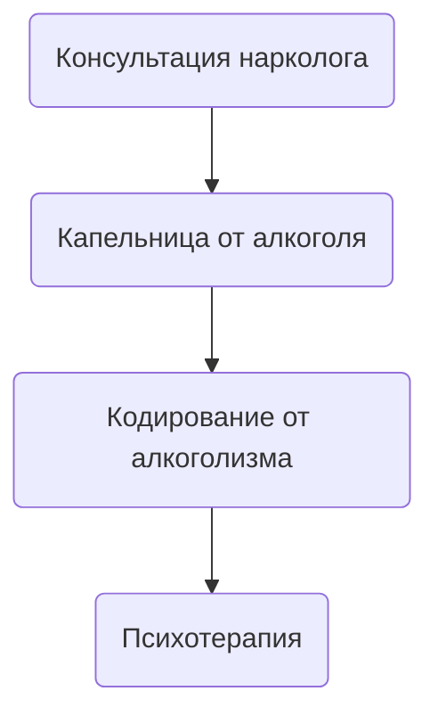

## Лечение женского алкоголизма

**Женский алкоголизм** — это тяжёлое хроническое патологическое состояние, которое развивается у женщины в результате длительного и регулярного употребления алкоголя. Ему присущи бесконтрольный и частый приём спиртного в больших объёмах, а также такие признаки, как: высокая толерантность к алкоголю, утрата социального контроля, патологическое влечение к выпивке и необходимость похмелиться.

***

## Симптомы женского алкоголизма

Симптомы можно условно разделить на **ранние и поздние:**

**Ранние симптомы:**

* Повышенная раздражительность, психоэмоциональная лабильность;
* Потеря аппетита во время употребления алкоголя;
* Учащение эпизодов употребления;
* Алкоголь сопровождает почти любое событие — прогулки, выходные и т. д.

**Поздние симптомы:**

* Нарушения сна, бессонница;
* Отсутствие рвотного рефлекса даже при большом количестве алкоголя;
* Высокая переносимость алкоголя и постоянное желание выпить;
* Симптомы абстиненции (опохмеление);
* Патологическая лживость и скрытность поведения.

***

## Как формируется алкоголизм у женщин?

Алкогольная зависимость у женщин развивается под влиянием биологических, психологических и социальных факторов:

* Биология: женский организм быстрее привыкает к алкоголю из-за особенностей метаболизма и гормонального фона;
* Психология: женщины чаще используют алкоголь как способ снятия тревоги, стресса, подавленного настроения;
* Социум: неблагоприятная среда, проблемы в отношениях, одиночество могут способствовать злоупотреблению.

Женский алкоголизм прогрессирует быстрее, чем у мужчин, и сопровождается более тяжёлыми последствиями — как физическими, так и психическими. Проблему усугубляет тот факт, что женщины реже обращаются за помощью.

***

## Признаки женского алкоголизма

* Частое и неконтролируемое употребление алкоголя;
* Потеря интереса к работе, семье, социальным контактам;
* Изменения внешности: отёки, покраснение лица, сосудистые звёздочки, ухудшение кожи и волос;
* Эмоциональные срывы: агрессия, депрессия, раздражительность;
* Рост толерантности — нужно больше алкоголя для достижения эффекта;
* Потеря контроля — невозможность остановиться;
* Абстинентный синдром (тремор, головная боль, потливость и др.);
* Соматические нарушения: поражения печени, сердца, ЖКТ.

***

## Стадии женского алкоголизма

**1. Ранняя стадия:**
Алкоголь употребляется часто и "по малейшему поводу" — после тяжёлого дня, в одиночестве, ради расслабления. Нарушается сон, повышается раздражительность, снижается самоконтроль.

**2. Стадия физической зависимости:**
Появляются запои, необходимость опохмеляться, приоритет алкоголя над остальными жизненными целями. Женщина может менять планы ради возможности выпить.

**3. Стадия деградации:**
Алкоголь становится смыслом жизни. Личность деградирует, снижается интеллект, утрачивается чувство ответственности. Развиваются тяжёлые психические и соматические нарушения, включая суицидальные мысли и хронические заболевания.

***

## Как вылечить женский алкоголизм в Одессе?

Чтобы вылечить **женский алкоголизм,** необходимо обратиться за помощью к врачам-наркологам в Одессе по номеру [050-021-69-57](tel:050216957). Специалист проведёт первичную консультацию, определит стадию зависимости и подберёт индивидуальный план лечения.

Лечение включает три ключевых этапа:

1. [Детоксикация](https://umbrella-plus.com.ua/kapelnica-ot-alkogolia-od/) — [капельница от алкоголя на дому](https://umbrella-plus.com.ua/kapelnica-ot-alkogolizma-na-domy-od/) или в стационаре;
2. Кодирование — по методу Довженко, медикаментозным уколом или подшивкой;
3. Психотерапия — для закрепления трезвости и предотвращения срывов.

***

## Стоимость лечения женского алкоголизма в Одессе

Цены на лечение начинаются от 1499 грн и могут варьироваться в зависимости от стадии заболевания и объёма необходимых медицинских мероприятий.

| Самые Популярные Услуги \| UmbrellaPlus                                                                    | Цена        |
| ---------------------------------------------------------------------------------------------------------- | ----------- |
| [Капельница от похмелья Одесса](https://umbrella-plus.com.ua/kapelnica-ot-alkogolia-od/)                   | От 1699 грн |
| [Капельница от похмелья на дому Одесса](https://umbrella-plus.com.ua/kapelnica-ot-alkogolizma-na-domy-od/) | От 1999 грн |
| [Вывод из запоя Одесса](https://umbrella-plus.com.ua/vivod-iz-zapoia-od/)                                  | От 1699 грн |
| [Вывод из запоя на дому Одесса](https://umbrella-plus.com.ua/vivod-iz-zapoia-na-domy-od/)                  | От 1999 грн |

## Лечение женского алкоголизма в Одессе

**Лечение женского алкоголизма** всегда должно быть комплексным и состоять из медикаментозной и психологической помощи, включая в себя все три главных этапа в лечении алкогольной зависимости. Только пройдя все этапы, можно добиться длительной, а иногда и пожизненной ремиссии, создав условия для постоянной трезвости женщины, зависимой от спиртных напитков.

1. **Первый этап лечения женского алкоголизма** — консультация нарколога для оценки тяжести состояния, постановки диагноза и определения формы алкоголизма.
2. **Второй этап** — капельница от алкоголя или выведение из запоя. На этом этапе необходимо обеспечить детоксикационную терапию для снятия интоксикации и восстановления работы всех органов и систем организма пациентки.
3. **Третий этап** — кодирование от алкогольной зависимости для достижения длительной медикаментозной ремиссии с последующим формированием полного отвращения к спиртным напиткам.
4. **Четвёртый этап** — длительная психотерапевтическая работа, направленная на изменение ложных убеждений, связанных с зависимостью, а также на формирование психического отвращения к алкоголю.

## Кодирование от женского алкоголизма в Одессе

Кодирование от женского алкоголизма в Одессе проводится одним из трёх методов:

1. [Кодирование с помощью укола](https://umbrella-plus.com.ua/services/kodirovka-ot-alkogolia-umbrellaplus/) — самый популярный метод. Суть заключается во введении пациентке препарата дисульфирам в инъекционной форме. Вещество вызывает немедленную токсическую реакцию в случае употребления алкоголя, что может привести к тяжёлым последствиям, вплоть до летального исхода.
2. **Кодирование с помощью подшивки** — хирургический метод, при котором под кожу имплантируется капсула с веществом, аналогичным дисульфираму, в высокой концентрации. При употреблении алкоголя возникает тяжёлая токсическая реакция, что делает даже мысль о спиртном пугающей для пациентки.
3. **Кодирование по методу Довженко** — психологический метод, основанный на гипнотерапии. Врач внушает пациентке стойкое отвращение к алкоголю на уровне подсознания, формируя внутреннюю мотивацию к трезвости.

***

## Женщина-алкоголик — что делать?

Если вы заметили, что ваша мама, супруга или сестра начала часто злоупотреблять спиртным, объясняя это стрессом, бессонницей или тревогой, не откладывайте — срочно обратитесь к наркологу. **Алкоголизм** — это всегда прогрессирующее заболевание, которое на ранних стадиях может проявляться минимально.

***

## Женский алкоголизм — фото до и после / Последствия

**У женщин, страдающих от алкогольной зависимости, появляются характерные внешние изменения:**

* Кожа теряет эластичность, становится сухой, шершавой и тусклой.
* Возможен желтоватый оттенок кожи из-за поражения печени.
* Хроническое обезвоживание и авитаминоз приводят к глубоким морщинам, особенно вокруг глаз и рта.
* Лицо часто выглядит опухшим из-за задержки жидкости.
* Появляются тёмные круги под глазами, капиллярные сетки и сосудистые звёздочки.
* Цвет лица становится нездоровым — серым или красноватым.
* Волосы и ногти становятся ломкими, тусклыми, теряют плотность и блеск.

## Клиника лечения женского алкоголизма в Одессе

Одним из лучших мест для лечения женского алкоголизма в Одессе считается медицинская служба **UmbrellaPlus «Безопасная Наркология».** В клинике квалифицированный врач-нарколог проведёт диагностику стадии и формы зависимости, подберёт комбинированное лечение, направленное не только на устранение симптомов, но и на работу с первопричиной зависимости. В ходе терапии формируется стойкое отвращение к любым спиртным напиткам.

Для записи на приём в **клинику UmbrellaPlus** «Безопасная Наркология» позвоните по номеру [050-021-69-57](tel:0500216957).

***

## Эффективное лечение женского алкоголизма в Одессе

Наиболее эффективным признано трёхэтапное лечение, включающее:

1. Медицинскую детоксикацию (капельницы от алкоголя на дому или в стационаре).
2. Кодирование от алкогольной зависимости.
3. Психотерапевтическую работу с формированием устойчивой мотивации к трезвости.

**Главная цель** — не просто временное улучшение, а достижение устойчивой ремиссии и формирование стойкого отвращения к алкоголю на физическом и психологическом уровне.

Чтобы получить комплексную помощь и бесплатную консультацию врача-нарколога, позвоните по номеру [050-021-69-57](tel:0500216957).

***

## Лечение хронического женского алкоголизма в Одессе

**Хронический женский алкоголизм** — одна из самых сложных форм зависимости, однако при правильном подходе возможна длительная ремиссия. Как правило, речь идёт о случаях, когда женщина регулярно употребляет алкоголь в течение 6–12 месяцев и более, чтобы справиться с тревожностью, апатией или плохим настроением.

Эффективное лечение предполагает:

* разрыв психологических установок, оправдывающих употребление;
* медикаментозную терапию;
* длительную психотерапию;
* формирование отвращения к алкоголю.

Такой подход позволяет вернуть женщине нормальную жизнь и сохранить здоровье.

***

## Народные методы лечения женского алкоголизма

Среди народных средств, которые могут использоваться как дополнение, но не замена медицинской помощи:

* щелочная минеральная вода для выведения токсинов;
* сорбенты (активированный уголь, Сорбекс) для очистки ЖКТ;
* аминокислотные комплексы (Бетаргин, Гепаргин) для поддержки печени и сердца;
* мягкие растительные седативные средства (пустырник, валерьянка) для нормализации сна.

**Важно:** самолечение может быть опасным! Всегда консультируйтесь с врачом. В **Одессе** вы можете получить помощь, обратившись по номеру [050-021-69-57](tel:0500216957).
