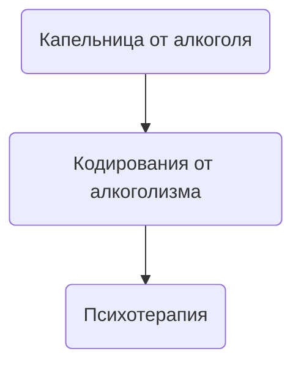

## Подшивка от алкоголя Одесса

Кодирование с помощью подшивки от алкоголя - это радикальный метод в лечении алкогольной зависимости , суть которого заключается в ведении пациенту подкожно импланта с гелем основа которого составляет дисульфирам. Хирургическое лечение алкогольной зависимости проводит врач нарколог на тяжелых стадиях алкогольной зависимости так как такой метод лечения алкоголизма является небезопасным и имеет определенный список осложнений и противопоказаний. Однако именно подшивка от алкоголя на сегодняшний день является самой сильной кодировкой от алкогольной зависимости. К плюсам такого метода еще можно отнести длительный срок самой кодировки так как с помощью подшивки пациенту вводится большая доза дисульфирама которая может находиться  в организме закодированного человека от 1 до 5 лет.

## Лечение алкоголизма с помощью подшивки от алкоголя

В Одессе можно подшиться от алкоголизма в медицинской службе UmbrellaPlus “безопасная наркология” . Что бы подшиться вам нужно получить первичную консультацию врача нарколога по телефону для получения направления на основные обследования и анализы перед хирургическим лечением. Перед проведением имплантации нужно не пить минимум пяти дней. Если все обследования и анализы в норме можно проводиться имплантацию Эспераль. После хирургического лечения врач нарколог выдаст справку и сертификат о проведенной процедуре, пациент отпускается домой через день в случаи если нет никаких послеоперационных осложнений. Что бы получить первичную консультацию нарколога позвоните по номеру 050-021-69-57.

## Подшивка от алкоголя Одесса

Подшивку от алкоголя проводят только в тех случаях когда классическое медикаментозное и психотерапевтическое лечение оказалось не эффективным и патологическую тягу к спиртному с бесконечными срывами невозможно остановить. Только в таких случаях зависимому пациенту можно предложить подшиться от алкоголизма с помощью Торпеда. Подшивка от алкоголя проводится в три этапа:

1. На первом этапе врач нарколог проводит местную анестезию и делает первые разрез подкожно жировой клетчатки, после чего края раны фиксируются и вводится в мышечный слой препарат на основе дисульфирама в гелевой формы.
2. На втором этапе происходит ушивания подкожно жировой клетчатки и сведение краев ран. Дальнейшая обработка антисептическими и инфузионная терапия с антибактериальными средствами.
3. На третьем этапе пациент остается под наблюдение еще на одни сутки с провидением медикаментозной терапии с целью предотвращения после операционных осложнений.

Если никаких негативных симптомов и синдромов через сутки после проведения хирургического лечения не было обнаружено то пациент выписывается и направляется домой.

## Подшиться от алкоголизма Одесса

Подшиться от алкоголизма термин обозначающий пройти хирургическое лечение алкогольной зависимости. Подшиться от алкоголизма это радикальный метод который направлен на введение пациенту огромной дозы дисульфирама с целью создания у пациента состояние длительной трезвости в процессе которого формируется сильное отвращение к любым спиртным напиткам. Стоит понимать что отвращение формируется именно на физическом уровне и что бы побороть патологическую тягу к спиртному кроме подшивки от алкоголизма пациенту обязательно показана длительная психотерапевтическая работа которая направленна на проработку ложных убеждений в пользу употребления спиртного а так же осознания проблем которые за собой приносит алкоголизм.

## Эффективное кодирование от алкоголизма в Одессе

Самым эффективным кодированием от алкоголизма считается укол или подшивка в состав которых входит дисульфирам , но стоит помнить кодирование не значит успешное лечение алкогольной зависимости. На сегодняшний день самым эффективным методом лечения алкогольной зависимости считается комбинированное лечение которое состоит из трех пунктов оказания помощи человеку который имеет патологическую тягу к спиртным напиткам а так же  не может контролировать дозированный прием алкоголя. В комбинированный метод лечения алкогольной зависимости входит:

Именно пройдя три этапа пациент сможет обрести длительной или даже пожизненную трезвость.

## Подшивка от алкоголя цена Одесса

Цена на хирургическое лечение алкогольной зависимости с помощью подшивки  от алкоголя в Одессе начинается от 9999грн.

| Услуга                                                                                                     | Цена         |
| ---------------------------------------------------------------------------------------------------------- | ------------ |
| [Лечение алкоголизма Одесса](https://umbrella-plus.com.ua/lechenie-alkogolizma-odessa/)                    | От 1499 грн  |
| [Вывод из запоя Одесса](https://umbrella-plus.com.ua/vivod-iz-zapoya/)                                     | От 1499 грн  |
| [Вывод из запоя на дому Одесса](https://umbrella-plus.com.ua/vivod-iz-zapoya-na-domu-odessa/)              | От 1699 грн  |
| [Капельница от алкоголя Одесса](https://umbrella-plus.com.ua/kapelnitsya-ot-alc/)                          | От 1499 грн  |
| [Капельница от алкоголя на дому Одесса](https://umbrella-plus.com.ua/kapelnitsya-ot-alc-na-domu-odessa/)   | От 1699 грн  |
| [Лечение пивного алкоголизма Одесса](https://umbrella-plus.com.ua/pivnoy-alkogolism/)                      | От 1499 грн  |
| [Лечение женского алкоголизма Одесса](https://umbrella-plus.com.ua/genskiy-alc/)                           | От 1499 грн  |
| [Кодирование от алкоголизма Одесса](https://umbrella-plus.com.ua/kodirovanie-ot-alc/)                      | От 3999 грн  |
| [Кодирование уколом Одесса](https://umbrella-plus.com.ua/kodirovanie-ukolom/)                              | От 3999 грн  |
| [Кодирование от алкоголизма уколом Дисульфирам](https://umbrella-plus.com.ua/kodirovka-ukolom-disulfiram/) | От 3999 грн  |
| [Кодирование от алкоголизма уколом Эспераль](https://umbrella-plus.com.ua/kodirovka-ukolom-espiral/)       | От 5500 грн  |
| Подшивка от алкоголя Одесса                                                                                | От 9999 грн  |
| [Кодирование по методу Довженко Одесса](https://umbrella-plus.com.ua/kodirovanie-dovgenko/)                | От 14999 грн |

## Подшиться от алкоголя Одесса

Подшиться от алкоголизма в Одессе можно в медицинском центре UmbrellaPlus "Безопасная наркология" помните что любое лечение алкоголизма начинается консультация и детоксикационной терапии с помощью капельницы от алкоголя , только пройдя курс детокса и выдержать определенное количество "трезвых дней" можно перейти ко второму этапу лечения зависимости а именно к подшивке от алкоголизма. Подшивка от алкоголя на сегодняшний день остается одним из самых проверенных и эффективных методов в лечении алкогольной зависимости. Врачи наркологи уже много лет успешно формируют у пациентов состояние длительной трезвости а так же возвращают людей к нормальной адекватной жизни в которой нет места спиртным напиткам.

## Вывод из запоя на дому или в стационаре

Выведение из запоя на дому или в стационаре Одессы является курсом комплексного лечения алкогольной зависимости целью которого является детоксикационная терапия , нормализация работы всех органов и систем а так же работы над психологическим аспектом самого пациента. Если сравнивать и углубляться в таблетированные или народные методы вывода из запоя то  мы увидим как высокоэффективная и качественная наркологическая помощью преобладает и имеет огромный отрыв в лечении даже самого тяжелого запойного состояния. Выведение из запоя на дому требует высокой квалификации и хороших навыков врача нарколога по этому домой выезжают только самые опытные доктора центра UmbrellaPlus “Безопасная наркология”.

подшивка от алкоголизма

кодирование от алкоголизма как это происходит

## Где делают подшивку от алкоголизма в Одесса

Мы UmbrellaPlus “Безопасная наркология” проводим хирургическое лечение алкогольной зависимости более чем в 6 городах Украины. Подшивку от алкоголя проводит врач нарколог или же врач хирург имеющий опыт работы в наркологических центрах. Так же подшиться от алкоголизма можно в любом частном наркологическом центре либо в государственной психиатрической больнице. Что бы провести подшивку от алкоголизма вам нужно позвонить по номеру 050-021-69-57.

## Нарколог Одесса

Что бы проконсультироваться с врачом наркологом по поводу кодировки от алкогольной зависимости или получить рекомендации для вывода пациента из запоя на дому или в стационаре вам нужно позвонить по номеру 050-021-69-57 в медицинский центр UmbrellaPlus “Безопасная наркология”. Консультация и вызов нарколога домой в Одессе является анонимной услугой. Врач приедет в течении 60 минут на машине без опознавательных знаков с обычными серыми сумками. В укладки доктора всегда имеются все необходимые препараты для оказания неотложной скорой помощи а так же для плавного и высокоэффективного лечения интоксикации любой сложности. Таким образом мы можем обеспечить полную анонимность и безопасность для наших пациентов.

## Вшили торпеду

"Вшили торпеду" - это народный термин обозначающий хирургический метод лечения алкогольной зависимости с помощью импланта на основе дисульфирама. Имплант с дисульфирамом вводится в подкожно жировую клетчатку для того что бы сделать невозможное безопасное употребление спиртного. Чаще всего лечение алкогольной зависимости с помощью подшивку от алкоголя проводят в тех случаях когда классические методы лечения алкогольной зависимости не имеют эффекта либо эффект при классическом лечение минимальный без возможности создания длительной трезвости.

## Подшивка от алкоголизма отзывы

Отзывы про подшивку от алкоголизма вы можете прочитать у нас на сайте в разделе "Отзывы". Все отзывы пишутся от руки пациентами которые успешно прошли курс лечения алкогольной зависимости.
